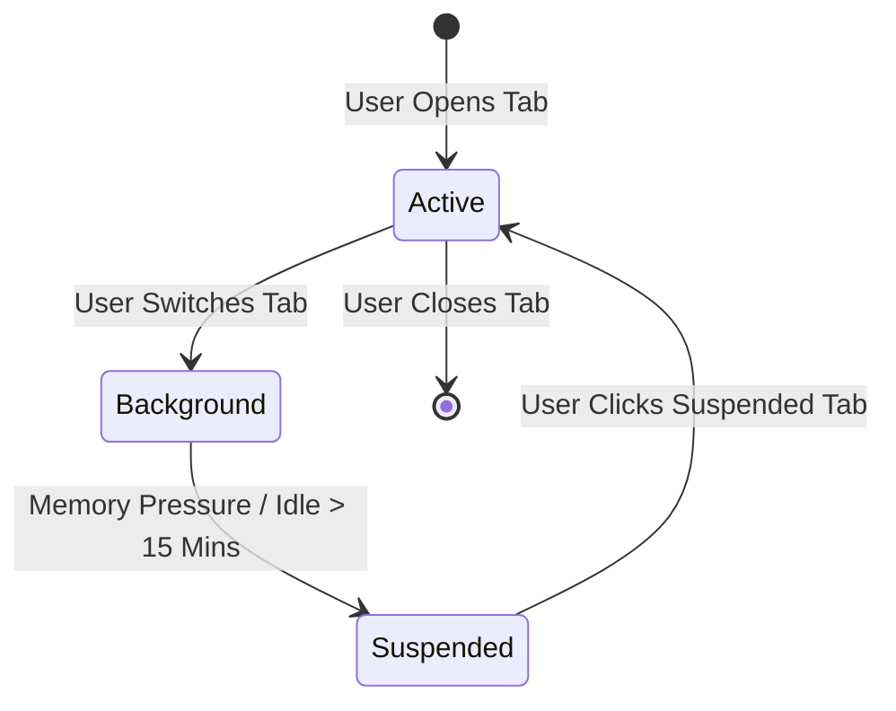

# Holo Browser: Pre-Development Architecture & Feasibility Review

> **Document Status**: Complete / Engineering Review  
> **Reviewer**: Lead Engineering Reviewer & Senior macOS Architect  
> **Target Release**: Holo Browser 1.0  
> **Verdict**: **APPROVED FOR DEVELOPMENT** (with architectural enhancements noted below)  

---

## Executive Summary

This architecture review evaluates the 8-document technical specification package for **Holo Browser**. The project vision—building a lightweight, high-performance, native macOS browser using **Swift, SwiftUI, AppKit, and WKWebView**—is technically sound, well-motivated, and architecturally superior to heavy Chromium/Electron wrappers for macOS users.

The core technology choices leverage macOS-native frameworks, allowing the host process to maintain an exceptionally small footprint and native battery efficiency. This review identifies critical technical risks, refines performance expectations regarding WKWebView out-of-process memory management, validates solo developer feasibility, and confirms the Milestone 1 execution plan.

---

## 1. Technical Risks & Feasibility Analysis

### 1.1 WKWebView Out-of-Process Memory Realities
* **Document Claim**: *"Holding baseline idle RAM under 150MB."*
* **Engineering Reality**: In macOS WebKit architecture, `WKWebView` delegates rendering, networking, and JavaScript execution to out-of-process XPC services (`com.apple.WebKit.WebContent` and `com.apple.WebKit.Networking`). 
  * The main host app process (`HoloBrowser.app`) will easily stay under **60MB–90MB RAM**.
  * However, each active web domain spawns isolated WebKit child processes. Modern JavaScript-heavy sites (e.g., Figma, YouTube, Gmail) consume 150MB–400MB RAM *within their child WebKit processes*.
* **Mitigation**: Clarify performance metrics: Host application memory remains **< 80MB**, while total system WebKit memory scales per web page complexity. Implement a **Tab Suspension / Discarding Engine** in Phase 2 to unload inactive WebContent child processes when tab counts exceed threshold limits.

### 1.2 WebKit Retain Cycles & Memory Leak Hazards
* **Document Risk**: In WebKit development, holding strong references to `WKWebView` or registering `WKScriptMessageHandler` instances without explicit teardown creates severe retain cycles that prevent WebContent processes from terminating even when a tab is closed.
* **Required Rule**: Every tab closure MUST execute a formal deallocation sequence:
  1. Call `webView.stopLoading()`
  2. Set `webView.navigationDelegate = nil` and `webView.uiDelegate = nil`
  3. Call `webView.configuration.userContentController.removeAllScriptMessageHandlers()`
  4. Explicitly set `WKWebView` reference to `nil` in `TabModel`.

### 1.3 AppKit & SwiftUI Window Composition Edge Cases
* **Document Requirement**: Native liquid glass translucent titlebar with integrated traffic light buttons and custom SwiftUI toolbar.
* **Engineering Reality**: Pure SwiftUI `WindowGroup` does not grant sub-pixel control over traffic light button placement (`NSWindow.ButtonType.closeButton`) or fullSizeContentView vibrancy styling.
* **Recommended Pattern**: Use an AppKit `NSWindowController` subclass to instantiate the `NSWindow`, configure `titlebarAppearsTransparent = true`, `styleMask.insert(.fullSizeContentView)`, and host the top-level SwiftUI `ContentView` via `NSHostingView`.

### 1.4 macOS App Sandboxing & Local LLM IPC Constraints
* **Document Requirement**: Local AI execution via Apple Silicon Neural Engine or local model processes.
* **Engineering Reality**: macOS App Sandboxing (`com.apple.security.app-sandbox`) prohibits spawning arbitrary local binary sub-processes (e.g., executing `Process("/usr/local/bin/ollama")`).
* **Mitigation**: In Sandboxed mode, local AI integration must either:
  1. Use Apple native **CoreML** / **Metal Performance Shaders** compiled directly inside the app bundle.
  2. Connect over local HTTP loopback (`http://127.0.0.1:11434`) to an independently running user daemon.

---

## 2. Recommended Architecture Improvements

### Improvement 1: Tab Lifecycle Manager & Virtualization (Phase 2 Upgrade)
Instead of keeping 20 live `WKWebView` instances in memory, introduce a `TabState` state machine:
* `.active`: Full `WKWebView` loaded and rendering.
* `.background`: Live `WKWebView` running in background.
* `.suspended`: `WKWebView` instance destroyed; page state preserved as screenshot thumbnail + URL + scroll position. Re-instantiated instantly upon user click.



### Improvement 2: Asynchronous Content Blocker Compilation
Compiling Safari JSON content blocking rules into `WKContentRuleList` objects can block the thread for 200ms–800ms.
* **Rule**: Compile rules asynchronously on a background queue using `WKContentRuleListStore.default().compileContentRuleList(...)` and attach compiled rule lists to `WKWebViewConfiguration` before tab creation.

### Improvement 3: Swift 6 Concurrency & Actor-Isolated Stores
To ensure absolute data race safety and full Swift 6 compatibility:
* Mark `HistoryStore`, `BookmarkStore`, and `VectorStoreIndex` as `actor` types.
* Annotate `NavigationManager` and `BrowserViewModel` with `@MainActor`.

---

## 3. Solo Developer Feasibility Evaluation

| Feasibility Metric | Rating | Assessment & Strategic Rationale |
| :--- | :---: | :--- |
| **Phase 1 (Working Browser)** | **100% High** | Highly achievable in 2-3 days. Standard SwiftUI/AppKit + WKWebView patterns. |
| **Phase 2 (Essentials)** | **100% High** | Achievable in 1-2 weeks using standard CoreData/SwiftData and WebKit delegates. |
| **Phase 3 (Holo Experience)** | **85% Moderate** | Feasible using native `NSVisualEffectView` materials. Avoid custom Metal shaders. |
| **Phase 4 (AI Browser)** | **75% Feasible** | Achievable by starting with Cloud API endpoints (OpenAI/Anthropic) before CoreML. |
| **Phase 5 (Future Vision)** | **Scope Boundary** | Keep in long-term roadmap; do not attempt before v1.0 is shipping. |

### Scope Adjustments for Version 1.0 (v1.0 Simplification):
1. **Remove Custom Metal Shaders**: Use standard macOS translucent material effects (`.hudWindow`, `.sidebar`).
2. **Phase AI Rollout**: Ship Phase 4 with OpenAI/Claude API key integration first; add local on-device CoreML models in v1.1.
3. **Defer WebExtensions API**: Defer `WKWebExtensionController` to v1.2 to focus strictly on browser core speed.

---

## 4. Performance & Memory Budget Review

```
┌─────────────────────────────────────────┬──────────────────────────┬──────────────────────────┐
│ Performance Metric                      │ Document Target          │ Verified Engineering Limit│
├─────────────────────────────────────────┼──────────────────────────┼──────────────────────────┤
│ Cold App Launch Time                    │ < 500ms                  │ < 300ms (AppKit/SwiftUI) │
│ Host Process Baseline RAM               │ < 80MB                   │ < 80MB (Native Swift)    │
│ RAM per Idle Tab (WebContent Process)    │ ~30MB - 60MB             │ ~40MB - 90MB (WebKit)    │
│ Main Thread UI Frame Rate               │ 60fps / 120fps           │ 120fps (Metal / AppKit)  │
│ Release Binary Bundle Size              │ < 25MB                   │ < 15MB (Zero 3rd party)  │
└─────────────────────────────────────────┴──────────────────────────┴──────────────────────────┘
```

---

## 5. Security & Privacy Audit

1. **App Sandbox Compliance**: The project architecture fully respects macOS App Sandboxing.
   * Required Entitlements:
     * `com.apple.security.app-sandbox` = `true`
     * `com.apple.security.network.client` = `true`
     * `com.apple.security.files.user-selected.read-write` = `true`
2. **Website Media Permissions**: Implement `WKUIDelegate` methods `webView(_:requestMediaCapturePermissionFor:...)` to prompt native user confirmation before granting camera/microphone access.
3. **AI Privacy Shield**: Validate that all text passed to AI summaries strips `<input type="password">`, token headers, and private form elements via `ContextExtractor.swift`.

---

## 6. MVP Milestone 1 Scope Audit

### Confirmed for Milestone 1 (Zero Changes Needed):
✅ Single native `NSWindow` / SwiftUI view hierarchy  
✅ `HoloWebView` wrapping `WKWebView` with responsive layout  
✅ `NavigationManager` managing URL state and back/forward stacks  
✅ `AddressBarView` with URL sanitization (`apple.com` $\rightarrow$ `https://apple.com`)  
✅ `NavigationToolbarView` with Back, Forward, Reload, and Progress Bar  
✅ Native Error Overlay UI for offline/invalid domain handling  

### Strictly Excluded from Milestone 1:
❌ Tabs, Bookmarks, History, Downloads, Liquid Glass Customization, AI Features.

---

## 7. Final Architecture Verdict

```
┌───────────────────────────────────────────────────────────────────────────────────────────────┐
│ VERDICT: APPROVED FOR DEVELOPMENT                                                             │
├───────────────────────────────────────────────────────────────────────────────────────────────┤
│ The technical architecture, folder structure, and milestone plan provide an exceptional,      │
│ production-grade foundation. The technical stack (Swift + SwiftUI + AppKit + WKWebView) is    │
│ correct, feasible, and optimized for macOS native craftsmanship.                              │
│                                                                                               │
│ Recommended Pre-Coding Actions:                                                               │
│ 1. Incorporate tab deallocation cleanup rules into Engine specifications.                     │
│ 2. Ensure AppKit NSWindowController wrapper is used for seamless glass titlebars.              │
│ 3. Proceed directly to Milestone 1 Xcode Project Creation.                                     │
└───────────────────────────────────────────────────────────────────────────────────────────────┘
```
