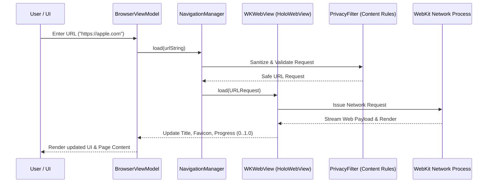

# Holo Browser: Technical Architecture Specification

> **Document Status**: Complete / Source of Truth  
> **Target Platform**: macOS 14.0+ (Sonoma), macOS 15.0+ (Sequoia)  
> **Architecture Pattern**: MVVM-C (Model-View-ViewModel-Coordinator) + Modular Engine Core  
> **Primary Technology Stack**: Swift 5.10 / Swift 6, SwiftUI, AppKit, WKWebView, CoreData/SwiftData, Security/Keychain, Combine/Observation  

---

## 1. Executive Architecture Overview

Holo Browser is engineered as a zero-bloat, native macOS application. It relies entirely on Apple’s native framework stack to eliminate third-party engine overhead while granting direct hardware access to Apple Silicon CPU cores, GPU execution pipelines, and the Apple Neural Engine (ANE).

```mermaid
graph TD
    subgraph App Layer [SwiftUI & AppKit Presentation]
        MW[BrowserMainWindow - NSWindow / WindowGroup]
        TB[Liquid Chrome Toolbar - SwiftUI]
        SB[Spatial Sidebar / Tab Bar - SwiftUI]
        OVERLAY[AI & Glass Overlays - SwiftUI]
    end

    subgraph ViewModel & Coordinator Layer
        VM[BrowserViewModel - @Observable]
        NAV[NavigationManager]
        TM[TabGroupManager]
        AIM[AIAssistantManager]
    end

    subgraph Core Engine Layer
        WK[WKWebView Engine Wrapper]
        RULE[WKContentRuleListManager - Privacy]
        STOR[CoreData / SwiftData Engine - History & Bookmarks]
        CACHE[Custom Native Cache & Cookie Store]
    end

    subgraph Hardware & System Layer [macOS System Services]
        WK_PROC[WebKit Networking & Rendering Processes]
        KEYCHAIN[Apple Keychain Services]
        ANE[Apple Silicon Neural Engine / CoreML]
    end

    App Layer --> ViewModel & Coordinator Layer
    ViewModel & Coordinator Layer --> Core Engine Layer
    Core Engine Layer --> Hardware & System Layer
```

---

## 2. Strategic Technology Stack Justification

### Why Swift + SwiftUI/AppKit + WKWebView?

1. **Memory Efficiency**: 
   * Electron apps spawn independent Chromium instances and Node.js runtimes per window, consuming 1.5GB–3GB RAM on launch.
   * Holo Browser shares system WebKit framework memory. Baseline startup footprint is **~80MB–140MB**, scaling linearly at only ~30MB–60MB per active tab via WebKit process isolation.
2. **Battery & CPU Performance**:
   * Direct integration with macOS `NSVisualEffectView` and Metal layer graphics engine ensures 120Hz ProMotion rendering without high GPU power draw.
   * Swift Native binaries execute compiled machine code with zero JIT bridges or V8 engine runtime costs.
3. **OS-Level System Integration**:
   * Direct access to macOS `NSWindow` APIs for window snap, full screen transition control, drag and drop, menu bar integration, system shortcuts, and Keychain Services.
4. **WKWebView Native Security & Sandboxing**:
   * Apple’s `WKWebView` runs web content inside out-of-process sandboxed rendering nodes (`com.apple.WebKit.WebContent`). Memory corruption in a web page cannot crash the Holo Browser host process.

### Why We Expressly Avoid Alternative Engines

```
┌───────────────────────────┬────────────────────────────────────────────────────────────────────────┐
│ Avoided Technology        │ Architectural Rationale & Why It Is Rejected                          │
├───────────────────────────┼────────────────────────────────────────────────────────────────────────┤
│ Electron / Node.js        │ - Massively excessive RAM/CPU bloat                                    │
│                           │ - Non-native UI components breaking macOS HIG                           │
│                           │ - Security vulnerabilities from bundled Node.js runtimes              │
├───────────────────────────┼────────────────────────────────────────────────────────────────────────┤
│ Chromium / CEF            │ - Adds 150MB+ binary footprint to installer                            │
│                           │ - Requires custom C++ build pipelines (unmaintainable for solo dev)    │
│                           │ - Bypasses macOS system energy & thermal optimizations                 │
├───────────────────────────┼────────────────────────────────────────────────────────────────────────┤
│ Custom Web Engine (C/Rust)│ - Takes 100+ engineer-years to implement basic HTML5/CSS3/JS compliance │
│                           │ - Complete distraction from browser UX and AI innovation               │
└───────────────────────────┴────────────────────────────────────────────────────────────────────────┘
```

---

## 3. Detailed Component Architecture

### 3.1 macOS Application & Window Architecture
* **`HoloBrowserApp.swift`**: SwiftUI `@main` entry point. Configures application lifecycle, global shortcut registration, and delegate binding.
* **`BrowserWindowController` (AppKit)**: Wraps `NSWindow` to provide custom glass titlebars, window vibrancy effects, traffic light button positioning, and seamless tab dragging across screens.
* **`NSViewRepresentable` Bridge**: Maps native `WKWebView` instances into SwiftUI view hierarchies while maintaining smooth layout constraints and gesture propagation.

### 3.2 Browser Engine & WKWebView Core



#### Key Architecture Rules for WKWebView:
1. **Single Configuration Pool**: Use shared `WKWebViewConfiguration` pools to optimize memory sharing across tabs.
2. **Process Isolation**: Each tab maps to a `HoloTabModel` wrapping a managed `WKWebView` instance.
3. **Script Controller Isolation**: Custom UserScripts (for theme injection or DOM reading) are added via `WKUserContentController` with strict sandbox isolation (`forMainFrameOnly: true`).

### 3.3 Data Storage Architecture
Holo Browser maintains a lightweight, local-first storage subsystem using **CoreData / SwiftData** and Apple **Keychain Services**:

* **History Store**: Persistent SQLite core holding `URL`, `Title`, `VisitCount`, `LastVisitedTimestamp`, `FaviconData`, and `SemanticEmbeddingVector`.
* **Bookmarks Store**: Hierarchical folder structure with tag indexing and rapid search indices.
* **Session Store**: Automatic state persistence saving open tab arrays, window positions, active workspaces, and scroll states across app restarts.
* **Keychain Store**: Encrypted credentials, authentication tokens, and user API keys (e.g., OpenAI/Anthropic keys for AI services).
* **WKHTTPCookieStore & Cache**: Managed WKWebView cookie pools isolated by Workspace.

### 3.4 Privacy & Security Architecture
* **Ad & Tracker Blocking**: Built-in blocklists compiled into native `WKContentRuleList` objects using Safari Content Blocking format. Zero JavaScript execution overhead for blocking.
* **Sandboxed Storage Isolation**: Each Workspace can instantiate isolated `WKWebsiteDataStore` instances (Incognito / Contextual profiles).
* **Telemetry Policy**: Strict zero-telemetry architecture. No external analytics SDKs, no tracking pixels, no telemetry servers.

### 3.5 AI Core Architecture

```mermaid
graph LR
    subgraph Context Extraction Layer
        DOM[DOM Text Extractor - WKUserScript]
        ACC[Accessibility Tree Adapter]
        VIEW[Visual Screenshot Sampler]
    end

    subgraph AI Processing Engine
        ROUTE[AI Request Router]
        LOCAL[Local CoreML / Ollama Engine]
        CLOUD[Cloud LLM Adapter - OpenAI/Claude]
        VECTOR[Local Vector Index - CoreData Embeddings]
    end

    subgraph UI Surface
        CHAT[Holo Assistant Panel]
        SUMMARY[Page Summary Overlay]
        SMART_BAR[Smart Search Bar]
    end

    DOM --> ROUTE
    ACC --> ROUTE
    VIEW --> ROUTE
    ROUTE --> VECTOR
    ROUTE --> LOCAL
    ROUTE --> CLOUD
    LOCAL --> UI Surface
    CLOUD --> UI Surface
    VECTOR --> UI Surface
```

1. **Context Extraction Engine**: Extracts clean page text, headlines, and structured metadata without injecting blocking JavaScript.
2. **Dual-Model Router**:
   * **On-Device Route**: Fast summaries, tab titling, and local semantic search handled via Apple Silicon Neural Engine (CoreML / Local models).
   * **Cloud Model Route**: Deep research synthesis, multi-page reasoning, and complex coding queries handled via secure user-configured API endpoints.
3. **Privacy Barrier**: Page content is stripped of password fields, input forms, and sensitive headers before transmission to any AI model.

---

## 4. Scalability & Future Expansion Plan

* **Plugin/Extension System**: Designed to support WebExtensions API via WKWebView's `WKWebExtensionController` (available in macOS 15.0+).
* **Multi-Window Sync**: Reactive state publishing via Swift `@Observable` and `Combine` ensures zero latency tab sync across multiple monitor setups.
* **Cloud Sync (Future)**: Prepared for optional end-to-end encrypted iCloud Sync (CloudKit) for bookmarks, history, and workspace presets.
