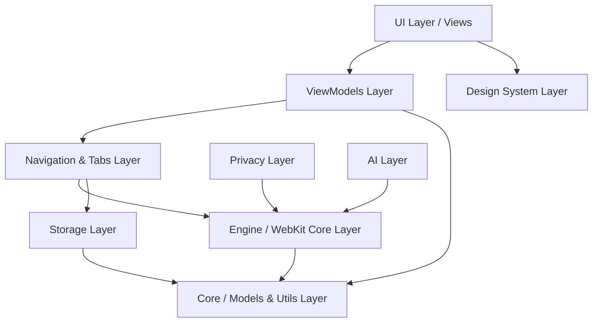

# Holo Browser: Recommended Xcode Project Folder Structure

> **Document Status**: Complete / Source of Truth  
> **Project Organization**: Clean Architecture & Domain-Driven Modular Layout  
> **Target Toolchain**: Xcode 15.0+ / Xcode 16.0+, Swift 5.10 / Swift 6  

---

## 1. Project Directory Layout Overview

```
HoloBrowser/
├── App/
│   ├── HoloBrowserApp.swift
│   ├── AppDelegate.swift
│   └── Assets.xcassets
├── Core/
│   ├── Constants/
│   ├── Extensions/
│   ├── Models/
│   └── Utilities/
├── Engine/
│   ├── HoloWebView.swift
│   ├── WKWebViewWrapper.swift
│   ├── WebScriptHandler.swift
│   └── UserContentControllerManager.swift
├── Tabs/
│   ├── TabModel.swift
│   ├── TabGroupManager.swift
│   └── WorkspaceManager.swift
├── Navigation/
│   ├── NavigationManager.swift
│   ├── URLSanitizer.swift
│   └── SecurityValidator.swift
├── ViewModels/
│   ├── BrowserViewModel.swift
│   ├── TabBarViewModel.swift
│   ├── AddressBarViewModel.swift
│   └── HistoryViewModel.swift
├── UI/
│   ├── Window/
│   │   ├── BrowserWindowController.swift
│   │   └── GlassTitlebarView.swift
│   ├── Chrome/
│   │   ├── AddressBarView.swift
│   │   ├── NavigationToolbarView.swift
│   │   └── ProgressIndicatorView.swift
│   ├── Tabs/
│   │   ├── TabBarView.swift
│   │   └── TabItemView.swift
│   └── Overlays/
│       ├── WebErrorOverlayView.swift
│       └── LoadingOverlayView.swift
├── Storage/
│   ├── PersistenceController.swift
│   ├── HistoryStore.swift
│   ├── BookmarkStore.swift
│   └── DownloadStore.swift
├── Privacy/
│   ├── ContentBlockerManager.swift
│   ├── WKContentRuleListCompiler.swift
│   └── TrackerDatabase.swift
├── AI/
│   ├── ContextExtractor.swift
│   ├── ModelRouter.swift
│   ├── LocalLLMEngine.swift
│   └── VectorStoreIndex.swift
├── Native/
│   ├── KeychainBridge.swift
│   ├── MenuBarManager.swift
│   └── TouchBarManager.swift
├── DesignSystem/
│   ├── Colors.swift
│   ├── Materials.swift
│   ├── Typography.swift
│   └── SpringAnimations.swift
└── Tests/
    ├── HoloBrowserTests/
    │   ├── NavigationManagerTests.swift
    │   ├── URLSanitizerTests.swift
    │   └── TabGroupManagerTests.swift
    └── HoloBrowserUITests/
        └── BasicBrowserUITests.swift
```

---

## 2. Directory Responsibilities & File Specs

### `App/`
* **Purpose**: Application initialization, main entry point, scene composition, and global app delegate lifecycle.
* **Key Files**:
  * `HoloBrowserApp.swift`: SwiftUI `@main` struct initializing the principal window group.
  * `AppDelegate.swift`: `NSApplicationDelegate` handling macOS system events (e.g., URL scheme opening, termination handling).
  * `Assets.xcassets`: Color catalogs, app icons, and symbol assets.

### `Core/`
* **Purpose**: Application-wide shared utilities, foundation models, constants, and Swift extensions. Zero dependencies on UI views or WKWebView.
* **Key Files**:
  * `Models/WebPageMetadata.swift`: Struct representing page title, favicon, and load status.
  * `Utilities/URLSanitizer.swift`: High-performance URL parsing, scheme auto-completion (`apple.com` → `https://apple.com`), and query sanitization.

### `Engine/`
* **Purpose**: WebKit core wrappers, WKWebView configuration management, user script injection, and low-level WebKit delegate bridges.
* **Key Files**:
  * `HoloWebView.swift`: Custom subclass or wrapper around `WKWebView` configuring process pools, custom user agents, and gesture handlers.
  * `WKWebViewWrapper.swift`: `NSViewRepresentable` bridge mapping `HoloWebView` into SwiftUI view hierarchies.
  * `UserContentControllerManager.swift`: Manages `WKUserScript` injection for DOM text extraction and privacy controls.

### `Tabs/`
* **Purpose**: State management for multi-tab sessions, spatial tab grouping, tab reordering logic, and workspace isolation.
* **Key Files**:
  * `TabModel.swift`: Data model representing an individual tab state (ID, title, URL, favicon, WKWebView reference).
  * `TabGroupManager.swift`: Manages active, pinned, and background tab lists.
  * `WorkspaceManager.swift`: Manages isolated workspace contexts.

### `Navigation/`
* **Purpose**: Core navigation state machine, URL loading requests, back/forward history stacks, and SSL/security state validation.
* **Key Files**:
  * `NavigationManager.swift`: Coordinates navigation events (`load`, `goBack`, `goForward`, `reload`) across active tabs.
  * `SecurityValidator.swift`: Validates HTTPS certificates, mixed-content warnings, and dangerous domain flags.

### `ViewModels/`
* **Purpose**: MVVM presentation logic. Annotates with `@MainActor` to bind engine events to reactive UI updates.
* **Key Files**:
  * `BrowserViewModel.swift`: Primary window view model managing current tab selection, URL bar text, loading state, and navigation state.
  * `AddressBarViewModel.swift`: Handles autocomplete suggestions, search query parsing, and SSL lock state display.

### `UI/`
* **Purpose**: Pure visual rendering layer containing SwiftUI views and AppKit bridge controllers.
* **Key Subfolders**:
  * `UI/Window/`: Custom `NSWindow` titlebars, liquid glass background visual effects (`NSVisualEffectView`).
  * `UI/Chrome/`: Address bar, navigation control buttons, progress indicators.
  * `UI/Tabs/`: Vertical/horizontal tab bars and individual tab tile views.
  * `UI/Overlays/`: Native error states, offline banners, and loading overlays.

### `Storage/`
* **Purpose**: CoreData / SwiftData persistence layer for browsing history, bookmarks, downloads, and user settings.
* **Key Files**:
  * `PersistenceController.swift`: CoreData stack initialization and background context management.
  * `HistoryStore.swift`: CRUD operations for browsing history records.

### `Privacy/`
* **Purpose**: Ad blocking, tracker prevention, cookie isolation, and WKContentRuleList compilation.
* **Key Files**:
  * `ContentBlockerManager.swift`: Compiles Safari-compatible JSON blocklists into `WKContentRuleList` instances.

### `AI/`
* **Purpose**: DOM text extraction, local vector embedding indices, CoreML/Neural Engine execution, and cloud LLM API adapters.
* **Key Files**:
  * `ContextExtractor.swift`: Reads main article body text from WKWebView DOM via script injection.
  * `ModelRouter.swift`: Directs AI tasks to local on-device models or secure cloud endpoints.

### `Native/`
* **Purpose**: Low-level macOS platform integration (Keychain Services, TouchBar, System Menu Bar, System Notifications).

### `DesignSystem/`
* **Purpose**: Global visual token definitions including glass translucent materials, liquid visual tokens, typography, and spring layout curves.

### `Tests/`
* **Purpose**: XCTest unit tests, performance benchmarks, and XCUITest UI automation scripts.

---

## 3. Dependency Rules & Architectural Hierarchy

To prevent spaghetti code, circular dependencies, and tight coupling, code files must adhere strictly to this directional dependency flow:



### Strictly Forbidden Dependency Directions:
❌ **Engine MUST NOT depend on ViewModels or UI**.  
❌ **Core MUST NOT import SwiftUI or WebKit**.  
❌ **Storage MUST NOT reference WKWebView instances directly**.  
❌ **Views MUST NOT call Storage or Network directly**.
