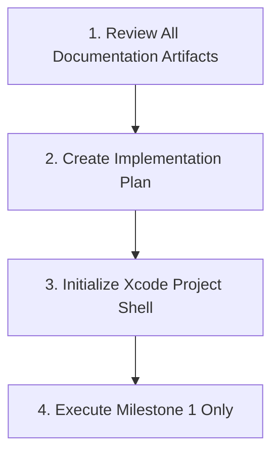

# Holo Browser: Antigravity AI Handoff & Execution Protocol

> **Target Recipient**: Antigravity / AI Coding Agent  
> **Document Role**: Direct Autonomous Execution Mandate  
> **Project Context**: Holo Browser (Clean Native Swift/macOS Project)  

---

## 1. Direct Mandate to the AI Agent

> **"You are building Holo Browser from a clean project."**

The previous Holo Browser project was an Electron/UI prototype. That repository exists strictly for design inspiration, UI layout reference, and feature ideas. **It is NOT the technical foundation.** You MUST NOT import Electron packages, Node.js scripts, web component wrappers, or legacy code from that prototype.

You are building a clean, native macOS web application using **Swift, SwiftUI, AppKit, and WKWebView**.

---

## 2. Non-Negotiable Development Rules

1. **Source of Truth**: The files inside `Holo Browser Documentation/` are your absolute engineering source of truth. If a feature or pattern contradicts this documentation, follow the documentation.
2. **Build Incrementally**: Build strictly in accordance with `04_MVP_Roadmap.md` and `06_First_Milestone_Plan.md`. Never jump ahead to Phase 3 glass styling or Phase 4 AI until Milestone 1 is verified.
3. **Never Create Fake Features**: Every UI control must map to real native code and real WebKit engine operations. Fake progress indicators, mock HTML strings, or simulated navigation are strictly forbidden.
4. **Test Everything**: Verify compilation and execution at every step. Ensure zero crashes, clean memory deallocation, and correct URL handling.
5. **No Superficial Dependencies**: Do not introduce external package manager bloat (CocoaPods, Carthage, unnecessary Swift Packages). Rely on native Apple frameworks.

---

## 3. Required Execution Protocol (Immediate First Steps)

Upon taking over this workspace to implement Holo Browser, you MUST follow this exact 4-step execution protocol:

### Step 1: Document Review & Verification
Read and index all 8 documentation files inside `Holo Browser Documentation/`:
* `01_Product_Vision.md`
* `02_Technical_Architecture.md`
* `03_AI_Coding_Specification.md`
* `04_MVP_Roadmap.md`
* `05_Project_Folder_Structure.md`
* `06_First_Milestone_Plan.md`
* `07_Feature_Priority_List.md`
* `08_Antigravity_Handoff.md`

### Step 2: Formulate Implementation Plan
Create your step-by-step implementation plan targeting **Milestone 1 ONLY** (as detailed in `06_First_Milestone_Plan.md`).

### Step 3: Initialize Clean Xcode Project
Create the `HoloBrowser` Xcode project in the workspace root directory with the exact folder layout specified in `05_Project_Folder_Structure.md`.

### Step 4: Build & Verify Milestone 1
Build the 8 core files for Milestone 1:
1. `HoloBrowserApp.swift`
2. `AppDelegate.swift`
3. `HoloWebView.swift`
4. `WKWebViewWrapper.swift`
5. `NavigationManager.swift`
6. `BrowserViewModel.swift`
7. `AddressBarView.swift`
8. `NavigationToolbarView.swift`

Verify against the **Milestone 1 Verification Checklist** in `06_First_Milestone_Plan.md` before proceeding further.

---

## 4. Final Handoff Confirmation

The engineering documentation package is complete, self-contained, and ready for immediate project initialization. 

**Proceed with implementation when instructed.**
