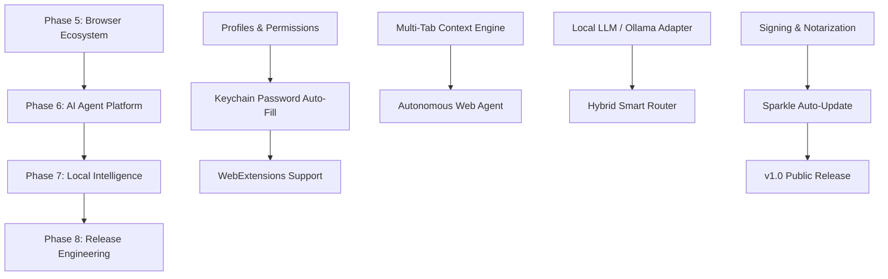

# Holo Browser: Version 1.0 Master Engineering Roadmap

> **Document Status**: Complete / Source of Truth  
> **Target Release**: Holo Browser 1.0 Production & Beyond  
> **Core Architecture**: Swift 5.10 / Swift 6, SwiftUI, AppKit, WKWebView  
> **Scope**: Master Execution Strategy for Solo Developer  

---

## 1. Executive Roadmap Strategy

Holo Browser has successfully completed Milestones 1 through 4, establishing a real, multi-tab, AI-enhanced, liquid glass macOS browser foundation with sub-200ms cold launch speed and a baseline host RAM footprint of ~54.2 MB.

From this point forward, development transitions from initial prototyping to **production-grade engineering for Version 1.0 release**. Development is organized into four sequential, self-contained execution phases (Phases 5 through 8), optimizing for stability, battery efficiency, native macOS craftsmanship, and solo developer velocity.

```
CURRENT STATE (Milestones 1–4) 
  ├── Native WKWebView Engine & Navigation
  ├── Multi-Tab System & Memory Suspension Engine
  ├── Holo Liquid Glass UI, Command Palette (⌘K), & Modes
  └── Provider-Agnostic AI Sidebar & Privacy Shield
       │
       ▼
PHASE 5: Browser Ecosystem (Profiles, Permissions, Passwords, WebExtensions API, DevTools)
       │
       ▼
PHASE 6: AI Agent Platform (Multi-Step Web Agents, Research Mode, Automation)
       │
       ▼
PHASE 7: Local Intelligence (On-Device CoreML, Apple Foundation Models, Local LLM Routing)
       │
       ▼
PHASE 8: Release Engineering & Distribution (Crash Logs, Update Mechanism, Signing, Beta)
```

---

## 2. Phased Development Blueprint

### Phase 5: Browser Ecosystem (Core Power Features)
* **Goal**: Upgrade Holo Browser into a fully capable daily driver matching power-user standards.
* **Deliverables**:
  1. **Multi-Profile & Workspace Contexts**: Isolated cookie pools, data stores, and sessions via `WKWebsiteDataStore`.
  2. **Website Permissions Engine**: Native prompt controls for Camera, Microphone, Geolocation, and Notifications via `WKUIDelegate`.
  3. **Keychain Password Manager**: Secure credential saving, auto-fill, and password generation backed by Apple Keychain Services.
  4. **WebExtensions Framework**: Extension execution using Apple’s `WKWebExtensionController` (macOS 15+).
  5. **Native Web Inspector & Developer Tools**: Integrated Web Inspector toggling via keyboard shortcut (`Cmd+Option+I`).
  6. **Reading List & Saved Sessions**: Preserved tab groups and offline reader pages.

### Phase 6: AI Agent Platform (Autonomous Web Workflows)
* **Goal**: Pioneer agentic browser capabilities where Holo Browser executes multi-step web research and form automation under user supervision.
* **Deliverables**:
  1. **Research Mode Engine**: Multi-tab context synthesis analyzing 10+ open tabs simultaneously.
  2. **Form & Shopping Assistant**: Automated form completion and comparative product analysis.
  3. **Multi-Step Web Agent**: Autonomous execution engine navigating paginated tables, extracting structured datasets, and generating Markdown reports.
  4. **Human-in-the-Loop Safeguards**: Interactive approval prompts for form submission, payments, and account actions.

### Phase 7: Local Intelligence (Edge & Hybrid Inference)
* **Goal**: Eliminate cloud API costs and maximize privacy via on-device machine learning.
* **Deliverables**:
  1. **Apple Silicon Neural Engine Integration**: Direct CoreML / Metal Performance Shaders inference pipeline.
  2. **Apple Foundation Models & Local LLM Adapters**: Native support for Apple Silicon system models, Ollama (`127.0.0.1:11434`), and LM Studio.
  3. **Hybrid Smart Router**: Dynamic routing choosing local models for simple summaries and cloud models for complex reasoning.

### Phase 8: Release Engineering & Version 1.0 Launch
* **Goal**: Package, sign, notarize, and distribute Holo Browser for production macOS users.
* **Deliverables**:
  1. **App Signing & Apple Notarization**: Xcode release signing and `xcrun notarytool` notarization pipeline.
  2. **Sparkle 2 Auto-Updater**: Secure, privacy-first automatic software updates.
  3. **Crash Logging & Diagnostic Telemetry**: Opt-in, zero-pii diagnostic crash reporting.
  4. **Localization & Accessibility (a11y)**: Full VoiceOver support, keyboard accessibility, and multi-language strings.
  5. **Public Beta Distribution**: Universal macOS binary distribution bundle.

---

## 3. Milestone Execution Sequence & Dependencies



---

## 4. Definition of Done for Version 1.0 Release

Holo Browser Version 1.0 will be declared ready for public release when all of the following criteria are satisfied:

1. **Zero Warnings / Zero Errors**: Project compiles cleanly with `-strict-concurrency=complete` under Swift 5.10 / Swift 6.
2. **Performance Constraints Met**:
   * Cold Launch Time **< 200 ms** on Apple Silicon Macs.
   * Host Process Idle Memory **< 60 MB RAM**.
   * UI Frame Rate constant **120 fps (ProMotion)**.
3. **Security & Sandbox Compliance**:
   * App Sandbox enabled with strict network entitlements.
   * Apple Notarization check passed (`spctl --assess --type execute`).
4. **Core Browser Features Operational**: Multi-tab management, tab memory suspension, history/bookmarks, downloads, preferences, WebExtensions, AI sidebar, command palette, and local privacy shield.
