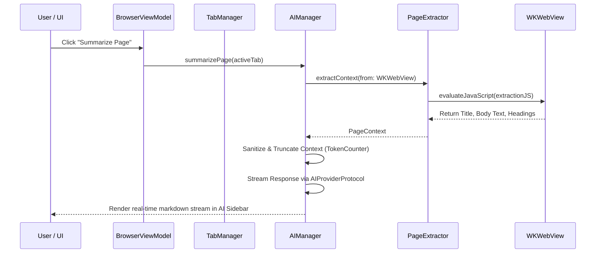

# Holo Browser: System Architecture Specification (v2.0)

> **Document Status**: Complete / Source of Truth  
> **Target Release**: Holo Browser 1.0 Production  
> **Architecture Pattern**: MVVM-C + Modular Domain Core + Decoupled Provider Engine  

---

## 1. System Architecture Overview Diagram

```mermaid
graph TD
    subgraph Presentation Layer [SwiftUI & AppKit Custom Vibrancy Window]
        MW[HoloMainWindow - NSWindow]
        TB[Holo Floating Toolbar - SwiftUI]
        TAB[Floating Glass Tab Strip - SwiftUI]
        AI_SIDE[AI Sidebar Drawer - SwiftUI]
        PALETTE[Cmd+K Command Palette Modal - SwiftUI]
    end

    subgraph ViewModel & Orchestration Layer
        BVM[BrowserViewModel - @MainActor]
        TM[TabManager - Tab Lifecycle & Suspension]
        AIM[AIManager - AI Facade]
        MM[ModeManager - Normal / Focus / Reading]
        CM[CommandManager - Command Registry]
    end

    subgraph Business Logic & Core Engines
        NAV[NavigationManager - WKNavigationDelegate]
        DOM[PageExtractor & SelectionExtractor - JS Bridges]
        PRIV[AIPrivacyManager & ContentBlocker]
        KEYCHAIN[PasswordManager & Keychain Bridge]
        PROFILE[ProfileManager & WKWebsiteDataStore]
    end

    subgraph Engine & System Infrastructure
        WK[HoloWebView / WebKit Process Pool]
        STORE[HistoryStore, BookmarkStore, MemoryStore, NoteStore]
        AI_ROUTER[ModelRouter - OpenAI / Anthropic / Gemini / CoreML]
        DOWNLOAD[DownloadManager - WKDownloadDelegate]
    end

    Presentation Layer --> ViewModel & Orchestration Layer
    ViewModel & Orchestration Layer --> Business Logic & Core Engines
    Business Logic & Core Engines --> Engine & System Infrastructure
```

---

## 2. Layer Definitions & Technical Contracts

### 2.1 Presentation Layer (SwiftUI + AppKit)
* **Responsibility**: Pure rendering of visual elements, responsive glass materials (`NSVisualEffectView`), window framing, and user gesture dispatch.
* **Strict Constraint**: Presentation components **must never** hold strong references to `WKWebView` or execute data transactions directly.

### 2.2 ViewModel Layer (`@MainActor`)
* **Responsibility**: Manages presentation state, reactive Combine bindings, and user action routing.
* **Concurrency Contract**: All ViewModels are annotated with `@MainActor` to guarantee main-thread UI updates without data races.

### 2.3 Ecosystem & Extension Layer
* **`ProfileManager`**: Manages isolated `WKWebsiteDataStore` instances for private profiles, work contexts, and persistent cookie pools.
* **`PasswordManager`**: Interfaces with Apple Keychain Services (`Security.framework`) for encrypted credential storage and WebKit auto-fill prompts.
* **`ExtensionManager`**: Wraps `WKWebExtensionController` (macOS 15+) for Safari/Chrome extension compatibility.

### 2.4 AI & Local Intelligence Engine
* **`AIManager`**: Facade exposing high-level AI tasks (`summarizePage`, `askPage`, `explainSelection`, `rewriteSelection`, `chat`).
* **`ModelRouter`**: Directs requests to remote cloud providers (Anthropic Claude, OpenAI GPT, Google Gemini) or local on-device inference engines (CoreML, Ollama, LM Studio).

---

## 3. Data Flow & Execution Sequence Diagram



---

## 4. Threading, Memory & Concurrency Strategy

1. **Swift 6 Concurrency Isolation**:
   * UI and ViewModels run strictly on `@MainActor`.
   * Persistent file transactions (`HistoryStore`, `BookmarkStore`, `MemoryManager`, `NoteManager`) use atomic JSON writes.
2. **WebKit Memory Isolation**:
   * Double-weak delegate connections (`weak var webView: WKWebView?` and `weak var navigationDelegate: WKNavigationDelegate?`) prevent XPC process leaks.
   * `TabManager` automatically unloads inactive `WKWebView` instances when background tab counts exceed threshold.
