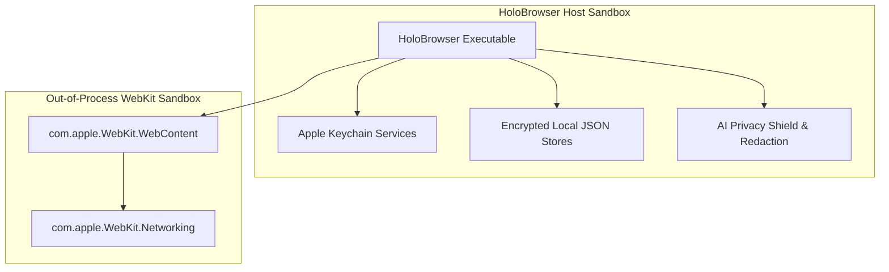

# Holo Browser: Security & Privacy Architecture Review

> **Document Status**: Complete / Source of Truth  
> **Privacy Model**: Zero Third-Party Telemetry & Local-First Security  

---

## 1. Security Architecture Principles



---

## 2. App Sandboxing & Entitlements

Holo Browser operates strictly inside macOS App Sandboxing (`com.apple.security.app-sandbox`).

```xml
<?xml version="1.0" encoding="UTF-8"?>
<!DOCTYPE plist PUBLIC "-//Apple//DTD PLIST 1.0//EN" "http://www.apple.com/DTDs/PropertyList-1.0.dtd">
<plist version="1.0">
<dict>
    <key>com.apple.security.app-sandbox</key>
    <true/>
    <key>com.apple.security.network.client</key>
    <true/>
    <key>com.apple.security.files.user-selected.read-write</key>
    <true/>
</dict>
</plist>
```

---

## 3. AI Privacy Shield & Redaction Protocol

Before any page context text is passed to remote AI providers (OpenAI, Anthropic, Gemini):

1. **User Permission Check**: Verify `AIPrivacyManager.privacyMode` (`.askBeforeSending`, `.alwaysSend`, `.neverSend`).
2. **Automated Content Redaction**:
   * Password input fields (`<input type="password">`) are excluded from DOM extraction.
   * Authorization bearer tokens, credit card regex patterns, and API keys are automatically masked.
   * User can select `.neverSend` to restrict AI operations strictly to local mock or on-device models.
