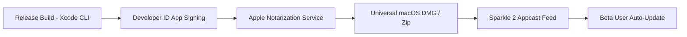

# Holo Browser: Public Beta Distribution & Testing Strategy

> **Document Status**: Complete / Source of Truth  
> **Target Audience**: External macOS Power Users & Developer Community  

---

## 1. Beta Distribution Pipeline

---

## 2. Public Beta Release Gates

Before opening Public Beta distribution:

1. **Notarization Ticket Stapled**: App bundle must pass `xcrun notarytool` and have notarization ticket stapled (`xcrun stapler staple HoloBrowser.app`).
2. **Sparkle 2 Integration**: Automatic update feed signed with Ed25519 public key.
3. **Diagnostic Feedback**: Direct feedback form accessible via `Help -> Report Feedback` routing to GitHub Issues.
